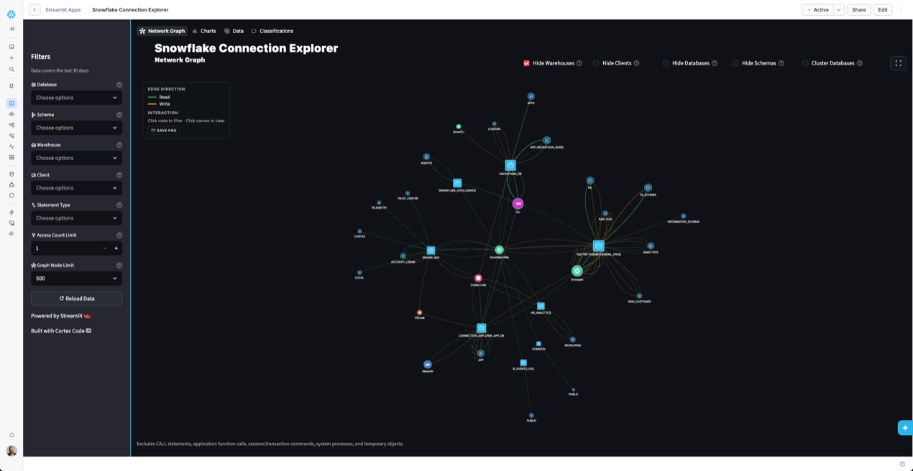

# Snowflake Connection Explorer

[](https://www.python.org/)
[](https://streamlit.io/)
[](https://www.snowflake.com/)
[](LICENSE)

**Full visibility into your Snowflake data access** — A Streamlit application that visualizes database, schema, warehouse, and client application access patterns using interactive network graphs powered by Snowflake Horizon Catalog.



## Table of Contents

- [Features](#features)
- [Prerequisites](#prerequisites)
- [Installation](#installation)
- [Running Locally](#running-locally)
- [Deploying to Snowflake](#deploying-to-snowflake-streamlit-in-snowflake)
  - [Prerequisites](#prerequisites-all-methods)
  - [Configuration](#configuration-required-before-deploying)
  - [Option 1: Quick Deploy with Snowflake CLI](#option-1-quick-deploy-with-snowflake-cli-recommended)
  - [Option 2: Manual Deploy with Snowflake CLI](#option-2-manual-deploy-with-snowflake-cli)
  - [Option 3: Deploy via Snowsight](#option-3-deploy-via-snowsight-no-cli-required)
- [Uninstalling](#uninstalling)
- [Architecture: Connection Strategy](#architecture-connection-strategy)
- [Project Structure](#project-structure)
- [Configuration](#configuration)
  - [Snowflake Infrastructure](#snowflake-infrastructure)
  - [Roles and Privileges](#roles-and-privileges)
  - [Client Application Mappings](#client-application-mappings)
- [License](#license)
- [Built With](#built-with)
- [Repository Policy](#repository-policy)

## Features

### Network Graph Page
- **Interactive vis.js Network**: Visualizes connections between clients, warehouses, databases, and schemas with physics-based layout
- **4-Level Hierarchy**: CLIENT → WAREHOUSE → DATABASE → SCHEMA flow visualization
- **SVG Client Icons**: Automatically displays branded icons for 60+ recognized client applications (Tableau, Power BI, Databricks, dbt, etc.)
- **Click-to-Filter**: Click any node to add it to the sidebar filters (additive); click empty canvas to clear all filters
- **Cluster Databases**: Group database nodes into a single cluster to simplify the view
- **Hide Node Types**: Toggle visibility for warehouses, clients, databases, or schemas — at least 2 types must remain visible
- **Full Screen Mode**: Expand the network graph to fill the browser window
- **Save PNG**: Export a high-resolution (4096px+) PNG of the network graph with readable labels

### Charts Page
- **Stacked Bar Charts**: Top databases, schemas, warehouses, and clients by access count, split by read/write direction
- **4-Column Sankey Diagrams**: Flow visualization of Client → Warehouse → Database → Schema access for reads and writes
- **Heatmaps**: Database × Client, Schema × Client, and Warehouse × Client heat grids
- **Treemap**: Hierarchical view of access volume by database, schema, warehouse, and client

### Data Page
- **Interactive Table**: View raw access data with sortable and filterable columns
- **Group By**: Aggregate data by any combination of Client, Warehouse, Database, Schema, or Direction
- **Access Totals**: Row counts and total access count summaries

### Classifications Page
- **Client Application Editor**: View and edit the `CLIENT_APP_CLASSIFICATION` table that maps raw client strings to friendly display names
- **Inline Editing**: Update classification entries directly in the app with changes written back to Snowflake

### About Page
- **Built with Cortex Code**: Productivity showcase comparing manual vs AI-assisted development time
- **Animated CSS Bar Chart**: Side-by-side comparison of manual hours vs Cortex Code hours per component
- **Capability Cards**: Code generation highlights and knowledge/research areas with SVG icons
- **Project at a Glance**: 8-stat grid showing files, LOC, commits, tests, and more
- **Call to Action**: Animated CTA with floating orbs and gradient button linking to Cortex Code

### General
- **Multi-Page Navigation**: Separate pages for Network Graph, Charts, Data, Classifications, and About with top-of-page navigation
- **Real-time Data**: Pulls from Snowflake's `account_usage` views via Horizon Catalog
- **Smart Client Detection**: Automatically identifies 60+ application types
- **Flexible Filtering**: Filter by database, schema, warehouse, client, organization, direction, and access count
- **Theme Support**: Adapts to Streamlit's light and dark themes
- **Sample Data Mode**: Works locally without Snowflake connection for demos

## Prerequisites

- Python 3.11+
- [uv](https://docs.astral.sh/uv/) (recommended) or conda
- Snowflake account (optional — sample data available for demos)

## Installation

### Option 1: Using uv (Recommended)

```bash
# Clone the repository
git clone https://github.com/sfc-gh-mfulkerson/data-lake-explorer.git
cd data-lake-explorer

# Install dependencies and run
uv run streamlit run streamlit_app.py
```

`uv` will automatically create a virtual environment and install all dependencies from `pyproject.toml`.

### Option 2: Using conda

```bash
# Clone the repository
git clone https://github.com/sfc-gh-mfulkerson/data-lake-explorer.git
cd data-lake-explorer

# Create conda environment
conda env create -f environment.yml
conda activate streamlit-connection-explorer
```

## Running Locally

```bash
# With uv
uv run streamlit run streamlit_app.py

# With conda (after activating the environment)
streamlit run streamlit_app.py
```

The app will open in your browser at `http://localhost:8501`

**Note**: Without a Snowflake connection, the app will display sample data for demonstration purposes.

## Deploying to Snowflake (Streamlit in Snowflake)

> This app targets the **Streamlit container runtime** (Preview). It runs as a long-lived service on a compute pool, shared across all viewers, with packages installed from PyPI via `pyproject.toml`.

### Prerequisites (All Methods)

**Snowflake account requirements:**
- A role with privileges to create databases, warehouses, compute pools, and integrations (default: `ACCOUNTADMIN`). See [Roles and Privileges](#roles-and-privileges) for details.
- `IMPORTED PRIVILEGES` on the shared `SNOWFLAKE` database (for `account_usage` views).

### Configuration (Required Before Deploying)

Deployment is driven by two files that **must stay in sync**:

| File | Purpose |
|------|---------|
| `deploy/snowflake_data_set_up.sql` | SQL `SET` variables — controls what Snowflake creates |
| `deploy/deploy.conf` | Shell variables — controls what the deploy/uninstall scripts reference |

> **You must update both files if you change any value.** If they are out of sync, the deploy scripts will reference objects that don't exist or use wrong names.

**Step 1 — Create `deploy.conf`:**
```bash
cp deploy/deploy.conf.example deploy/deploy.conf
```

**Step 2 — Review and update the variables** in both files. The defaults are:

| Variable | Default Value | Also update in |
|----------|---------------|----------------|
| `DB_NAME` | `CONNECTION_EXPLORER_APP_DB` | `deploy.conf` + SQL |
| `SCHEMA_NAME` | `APP` | `deploy.conf` + SQL |
| `WH_NAME` | `CONNECTION_EXPLORER_WH` | `deploy.conf` + SQL + `snowflake.yml` |
| `COMPUTE_POOL_NAME` | `STREAMLIT_COMPUTE_POOL` | `deploy.conf` + SQL + `snowflake.yml` |
| `EAI_NAME` | `PYPI_ACCESS_INTEGRATION` | `deploy.conf` + SQL + `snowflake.yml` |
| `APP_OWNER_ROLE` | `SYSADMIN` | `deploy.conf` + SQL |
| `APP_NAME` | `SNOWFLAKE_CONNECTION_EXPLORER` | `deploy.conf` only (not in SQL) |
| `DEPLOY_ROLE` | `ACCOUNTADMIN` | SQL only (not in `deploy.conf`) |

**What the setup SQL creates:**
- Database, schema, warehouse, compute pool, and external access integration
- Tables: `CONNECTION_ACCESS_30D` (transient) and `CLIENT_APP_CLASSIFICATION`
- Stage: `STREAMLIT_STAGE`
- Stored procedure: `REFRESH_CONNECTION_ACCESS()`
- Serverless task: `DATA_ACCESS_REFRESH_TASK` (runs weekly, Sundays 6am CST)
- Role grants for the app owner role

> **Note:** At runtime, the app detects its database and schema from the active session (`CURRENT_DATABASE()` / `CURRENT_SCHEMA()`), so it works regardless of what names you choose during deployment.

---

### Option 1: Quick Deploy with Snowflake CLI (Recommended)

The fastest path. Requires [Snowflake CLI](https://docs.snowflake.com/en/developer-guide/snowflake-cli) v3.14+. Complete the [Configuration](#configuration-required-before-deploying) steps above first.

**Step 1:** Configure your Snowflake connection (one-time):
```bash
snow connection add
```

**Step 2:** Run the deploy script:

*Mac/Linux:*
```bash
./deploy/deploy.sh <connection_name>
```

*Windows (PowerShell):*
```powershell
.\deploy\deploy.ps1 -Connection <connection_name>
```

*Windows (CMD):*
```cmd
deploy\deploy.bat <connection_name>
```

The script will:
1. Run `snowflake_data_set_up.sql` to create all infrastructure and load initial data
2. Deploy the Streamlit app via `snow streamlit deploy` (reads `snowflake.yml` for container runtime config)
3. Grant the app owner role (`SYSADMIN`) access to the Streamlit app

**Step 3:** Open the app in Snowsight: **Projects** > **Streamlit** > **SNOWFLAKE_CONNECTION_EXPLORER**

---

### Option 2: Manual Deploy with Snowflake CLI

For more control over each step. Requires [Snowflake CLI](https://docs.snowflake.com/en/developer-guide/snowflake-cli) v3.14+. Complete the [Configuration](#configuration-required-before-deploying) steps above first.

**Step 1:** Run the setup SQL to create infrastructure and load data:
```bash
snow sql --connection <connection_name> \
    --filename deploy/snowflake_data_set_up.sql \
    --warehouse CONNECTION_EXPLORER_WH
```

**Step 2:** Deploy the Streamlit app (uses `snowflake.yml` for container runtime settings):
```bash
snow streamlit deploy \
    --connection <connection_name> \
    --database CONNECTION_EXPLORER_APP_DB \
    --schema APP \
    --replace
```

**Step 3:** Grant the app owner role access to the deployed app:
```bash
snow sql --connection <connection_name> \
    --warehouse CONNECTION_EXPLORER_WH \
    --query "GRANT USAGE ON STREAMLIT CONNECTION_EXPLORER_APP_DB.APP.SNOWFLAKE_CONNECTION_EXPLORER TO ROLE SYSADMIN"
```

**Step 4:** Open the app in Snowsight: **Projects** > **Streamlit** > **SNOWFLAKE_CONNECTION_EXPLORER**

---

### Option 3: Deploy via Snowsight (No CLI Required)

Deploy entirely through the Snowflake web UI. No local tooling needed — just a browser. Complete the [Configuration](#configuration-required-before-deploying) steps above first (you still need to review the SQL variables even if you're not using the CLI scripts).

**Step 1:** Run the setup SQL in Snowsight:
1. Sign in to [Snowsight](https://app.snowflake.com)
2. Open a **SQL Worksheet**
3. Set the role to `ACCOUNTADMIN` (or your deploy role)
4. Paste the contents of `deploy/snowflake_data_set_up.sql` and run all statements
5. Verify the infrastructure was created: `SHOW TABLES IN CONNECTION_EXPLORER_APP_DB.APP;`

**Step 2:** Create the Streamlit app:
1. Navigate to **Projects** > **Streamlit**
2. Click **+ Streamlit App**
3. Configure the app:
   - **App name**: `SNOWFLAKE_CONNECTION_EXPLORER`
   - **App location**: Database `CONNECTION_EXPLORER_APP_DB`, Schema `APP`
   - **App warehouse** (query warehouse): `CONNECTION_EXPLORER_WH`
   - **Python environment**: Select **Run on container**
   - **Compute pool**: `STREAMLIT_COMPUTE_POOL`
4. Click **Create** — Snowsight opens the app editor with default starter code

**Step 4:** Add the app files. Choose **one** of the following approaches:

**Option A — Git repository (recommended):**
1. In the Snowsight editor, click **Connect to repository**
2. Select or create a Git integration pointing to this repository
3. Choose the branch to deploy from — all files sync automatically

**Option B — Manual upload:**
1. In the Snowsight editor, use **+ (Add)** > **Upload file** to upload each file, preserving the directory structure:

   | Files | Path in editor |
   |-------|---------------|
   | `streamlit_app.py` | `streamlit_app.py` (root) |
   | `pyproject.toml` | `pyproject.toml` (root) |
   | `components/__init__.py`, `theme.py`, `assets.py`, `data.py`, `network.py`, `charts.py`, `client_mappings.py`, `setup.py` | `components/` |
    | `views/__init__.py`, `network.py`, `charts.py`, `data.py`, `classifications.py`, `about.py` | `views/` |
   | All `.svg` files in `static/` and `static/client-icons/` | `static/` and `static/client-icons/` |

2. Upload `streamlit_app.py` last (or click **Run** after all files are uploaded) to avoid partial-load errors.

**Step 4:** Add the external access integration for PyPI packages:
1. In the app editor, click the **vertical ellipsis menu** (upper-right) > **App settings**
2. Under **External access**, add `PYPI_ACCESS_INTEGRATION`
3. Click **Save**

The app will reboot and install packages from `pyproject.toml`. This may take a few minutes on first deploy.

**Step 5:** Grant the app owner role access. In a SQL Worksheet:
```sql
GRANT USAGE ON STREAMLIT CONNECTION_EXPLORER_APP_DB.APP.SNOWFLAKE_CONNECTION_EXPLORER TO ROLE SYSADMIN;
```

**Step 6:** Verify the app loads at **Projects** > **Streamlit** > **SNOWFLAKE_CONNECTION_EXPLORER**

## Uninstalling

To remove Connection Explorer objects from your account. By default, the uninstall scripts drop app-level objects (Streamlit app, task, procedure, tables, stage) but **keep the database and schema** intact. Use flags to escalate.

The scripts require `deploy/deploy.conf` (same file used for deployment) to know which objects to drop.

**Mac/Linux:**
```bash
# Remove app objects only (keeps database and schema)
./deploy/uninstall.sh <connection_name>

# Also drop the schema
./deploy/uninstall.sh <connection_name> --drop-schema

# Drop everything including the database
./deploy/uninstall.sh <connection_name> --drop-database
```

**Windows:**
```cmd
REM Remove app objects only (keeps database and schema)
deploy\uninstall.bat <connection_name>

REM Also drop the schema
deploy\uninstall.bat <connection_name> --drop-schema

REM Drop everything including the database
deploy\uninstall.bat <connection_name> --drop-database
```

Before executing, the script shows every action it will take (`DROP` or `KEEP` for each object) and requires confirmation.

This will remove:
- Streamlit app
- Scheduled refresh task
- Stored procedure
- Data tables
- Stage
- Schema (with `--drop-schema` or `--drop-database`)
- Database (with `--drop-database` only)

## Architecture: Connection Strategy

The app uses a three-tier connection strategy that adapts to wherever it's running:

| Environment | Connection Method | Configuration |
|---|---|---|
| **Streamlit in Snowflake** | `get_active_session()` — Snowflake auto-injects a pre-authenticated Snowpark session into the container runtime | None required; inherits role and warehouse from the Streamlit app object |
| **Local with credentials** | `st.connection("snowflake")` — Streamlit's built-in Snowflake connector reads from `.streamlit/secrets.toml` | Requires `.streamlit/secrets.toml` with account, user, and authentication details |
| **Local without credentials** | `session = None` — falls back to synthetic sample data | No configuration needed; the app runs in demo mode |

The logic lives in `streamlit_app.py` and executes on startup:

```python
try:
    from snowflake.snowpark.context import get_active_session
    session = get_active_session()
except Exception:
    try:
        conn = st.connection("snowflake")
        session = conn.session()
    except Exception:
        session = None
```

**Key points:**
- When deployed to Snowflake, there are **no credentials to manage** — the platform handles authentication transparently via `get_active_session()`
- The app never uses raw `snowflake.connector` or `Session.builder` — all queries go through the Snowpark session
- All data access uses `session.sql(...).to_pandas()` to execute SQL and return DataFrames

## Project Structure

```
data-lake-explorer/
├── streamlit_app.py              # Main app entry point and multi-page router
├── views/                        # Streamlit view modules (not in pages/ to avoid auto-discovery)
│   ├── network.py                # Network graph page
│   ├── charts.py                 # Charts page (bars, Sankey, heatmaps, treemap)
│   ├── data.py                   # Data table page with group-by
│   ├── classifications.py        # Client classification editor page
│   └── about.py                  # About page — Cortex Code productivity showcase
├── components/                   # Shared components and logic
│   ├── network.py                # vis.js network rendering (inline HTML/JS)
│   ├── charts.py                 # Plotly chart builders
│   ├── data.py                   # Data loading and filtering
│   ├── assets.py                 # SVG icon loading and encoding
│   ├── client_mappings.py        # Client application detection rules
│   ├── theme.py                  # Snowflake brand colors and theme helpers
│   └── setup.py                  # Auto-setup and dynamic table name resolution
├── static/                       # Static assets
│   ├── client-icons/             # 60+ branded SVG client icons
│   ├── snowflake-database.svg    # Database node icon (rounded square)
│   ├── snowflake-warehouse.svg   # Warehouse node icon (diamond)
│   ├── snowflake-schema.svg      # Schema node icon (hexagon)
│   └── snowflake-bug-logo.*      # Snowflake logo
├── deploy/                       # Deployment and infrastructure scripts
│   ├── snowflake_data_set_up.sql # Database/schema/task setup script
│   ├── deploy.conf.example       # Configuration template (copy to deploy.conf)
│   ├── deploy.sh / deploy.bat / deploy.ps1  # Deployment scripts
│   └── uninstall.sh / uninstall.bat         # Uninstall scripts
├── snowflake.yml                 # Snowflake CLI deployment config
├── pyproject.toml                # Python project config and dependencies
├── docs/                         # Developer documentation and lessons learned
└── README.md
```

## Configuration

### Snowflake Infrastructure

The deployment script (`deploy/snowflake_data_set_up.sql`) creates the following resources. All names are configurable via variables at the top of the script.

#### Resources Created by Deployment

| Resource | Name | Type | Purpose |
|----------|------|------|---------|
| **Database** | `CONNECTION_EXPLORER_APP_DB` | Standard | Houses all app objects |
| **Schema** | `APP` | Standard | Contains tables, procedures, tasks, and stage |
| **Warehouse** | `CONNECTION_EXPLORER_WH` | Medium, Gen 2 | Runs queries for the Streamlit app and refresh procedure. Auto-suspends after 60s. Query acceleration enabled. |
| **Compute Pool** | `STREAMLIT_COMPUTE_POOL` | CPU_X64_XS (1 node) | Runs the Streamlit app container when deployed to Snowflake. Auto-suspends after 300s. |
| **Stage** | `STREAMLIT_STAGE` | Internal, directory-enabled | Stores the deployed Streamlit app files |
| **Table** | `CONNECTION_ACCESS_30D` | Transient | 30-day access snapshot (no time travel/fail-safe overhead) |
| **Table** | `CLIENT_APP_CLASSIFICATION` | Standard | Client application pattern-matching rules (304 rows, seeded by the app) |
| **Procedure** | `REFRESH_CONNECTION_ACCESS()` | SQL | Aggregates data from `account_usage` views into the access table |
| **Task** | `DATA_ACCESS_REFRESH_TASK` | Serverless | Runs `REFRESH_CONNECTION_ACCESS()` weekly (Sundays 6am CST) |
| **Streamlit App** | `SNOWFLAKE_CONNECTION_EXPLORER` | Streamlit | The deployed application (created by `snow streamlit deploy`) |

#### External Dependencies

These resources must exist **before** deployment:

| Resource | Purpose | Notes |
|----------|---------|-------|
| `SNOWFLAKE` database | Source data (`account_usage` views) | Shared database present in every Snowflake account. Requires `IMPORTED PRIVILEGES` grant. |

#### Customizing Resource Names

All resource names are configurable via variables at the top of `deploy/snowflake_data_set_up.sql`. If you change any value there, update the matching entry in `deploy/deploy.conf` so the deploy and uninstall scripts stay in sync. See [Prerequisites (All Methods)](#prerequisites-all-methods) for the full variable list.

### Roles and Privileges

The deployment uses a two-role model:

| Role | Default | Purpose |
|------|---------|---------|
| **Deploy Role** | `ACCOUNTADMIN` | Runs the setup script — creates all resources, grants privileges, and configures the task. Only needed during deployment. |
| **App Owner Role** | `SYSADMIN` | Owns and runs the Streamlit app day-to-day. Receives scoped grants from the deploy role. |

#### Deploy Role Privileges

The deploy role needs:

| Privilege | Purpose |
|-----------|---------|
| `CREATE DATABASE ON ACCOUNT` | Create `CONNECTION_EXPLORER_APP_DB` |
| `CREATE WAREHOUSE ON ACCOUNT` | Create `CONNECTION_EXPLORER_WH` |
| `CREATE COMPUTE POOL ON ACCOUNT` | Create `STREAMLIT_COMPUTE_POOL` |
| `CREATE SCHEMA` on the database | Create the `APP` schema |
| `CREATE TABLE`, `CREATE STAGE`, `CREATE PROCEDURE` on the schema | Create app objects |
| `CREATE TASK`, `EXECUTE TASK` on account or schema | Create and run the refresh task |
| `IMPORTED PRIVILEGES ON DATABASE SNOWFLAKE` | Access `account_usage` views |

#### App Owner Role Grants

The setup script grants the app owner role exactly what it needs to operate:

| Grant | Scope |
|-------|-------|
| `USAGE` | Database, schema, warehouse, compute pool |
| `SELECT`, `INSERT`, `UPDATE` | All tables in `APP` schema |
| `CREATE TABLE`, `CREATE STAGE` | `APP` schema |
| `USAGE` | `PYPI_ACCESS_INTEGRATION` |
| `USAGE` | `REFRESH_CONNECTION_ACCESS()` procedure |
| `OPERATE` | `DATA_ACCESS_REFRESH_TASK` |
| `EXECUTE MANAGED TASK ON ACCOUNT` | Required for serverless tasks |
| `USAGE` | Streamlit app (granted by deploy script after `snow streamlit deploy`) |

> **Note:** Access to `account_usage` views requires `IMPORTED PRIVILEGES` on the shared `SNOWFLAKE` database. This is typically granted by an account administrator:
> ```sql
> GRANT IMPORTED PRIVILEGES ON DATABASE SNOWFLAKE TO ROLE <your_role>;
> ```

#### Data Sources

The refresh procedure queries these `snowflake.account_usage` views:
- `snowflake.account_usage.sessions`
- `snowflake.account_usage.query_history`
- `snowflake.account_usage.access_history`

Results are pre-aggregated into `<your_database>.<your_schema>.CONNECTION_ACCESS_30D` for fast dashboard performance. The app resolves the actual database and schema at runtime.

### Client Application Mappings

The app automatically recognizes 60+ client applications including:
- BI Tools: Tableau, Power BI, MicroStrategy, Domo
- ETL/ELT: Databricks, Airflow, Azure Data Factory, Alteryx
- Development: Python, JDBC, DBeaver, VSCode
- And many more...

## License

See [LICENSE](LICENSE) file.

## Built With

- [Streamlit](https://streamlit.io/) - The web framework
- [vis.js](https://visjs.org/) - Interactive network graph visualization
- [Plotly](https://plotly.com/python/) - Charts (bar, Sankey, heatmap, treemap)
- [Snowpark for Python](https://docs.snowflake.com/en/developer-guide/snowpark/python/index) - Snowflake connectivity
- [Cortex Code CLI](https://docs.snowflake.com/en/user-guide/cortex-code/cortex-code) - AI-powered development assistant

## Repository Policy

This repository is published **as-is** for reference and reuse.

- **Support**: No support is provided.
- **Issues / Discussions**: Not accepted.
- **Pull requests**: Not accepted (please fork if you'd like to modify).
